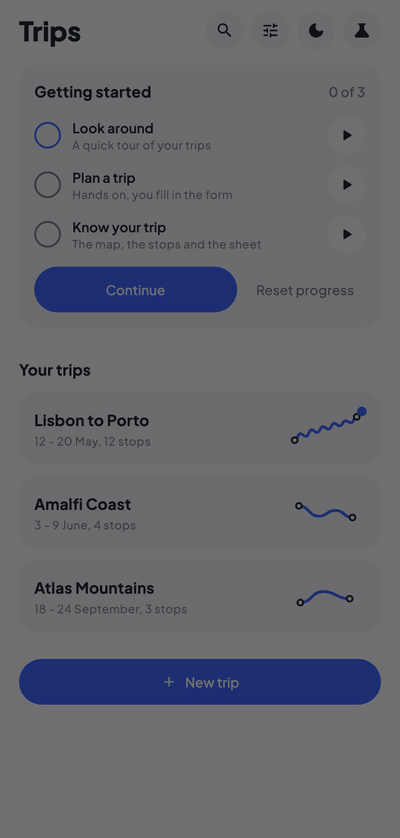
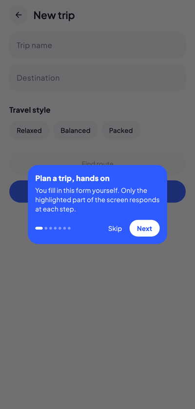
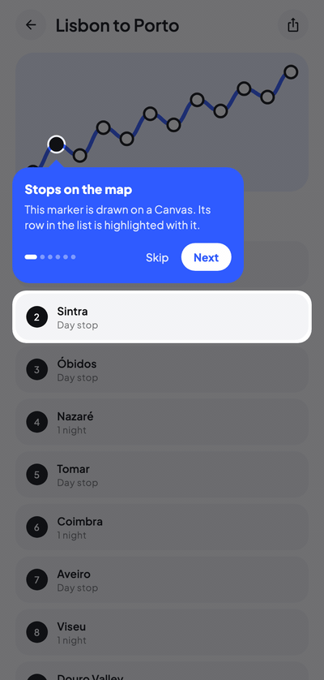
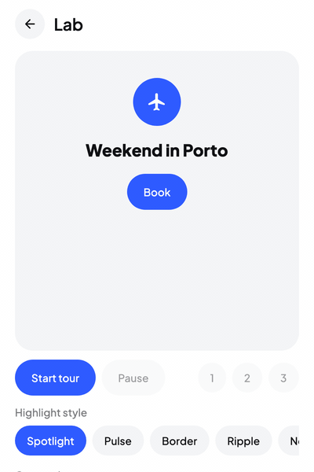

# Waypoint

**Product tours and feature showcases for Compose Multiplatform.**

[](http://kotlinlang.org)
[](https://www.jetbrains.com/lp/compose-multiplatform)
[](https://github.com/MohamedRejeb)
[](https://opensource.org/licenses/Apache-2.0)
[](https://search.maven.org/search?q=g:%22com.mohamedrejeb.waypoint%22)

<p align="center">
  
  
  
</p>

Waypoint walks your users through your app: it dims the screen, cuts a hole around the thing you want them to look at, and puts a tooltip next to it. You describe the steps in a small DSL, tag your composables with a modifier, and the library handles positioning, animation, scrolling and input blocking.

It runs on **Android**, **iOS**, **Desktop** and **Web** (JS and Wasm) from the same code.

## What it does

- **Tours**: spotlight, pulse, border or ripple highlights, with a tooltip that flips and clamps to stay on screen.
- **Hands-on steps**: let the user type or tap inside the highlighted element while the rest of the screen is blocked, and move on when they have done it (`advanceOn`).
- **Works where your UI is**: targets in scrolling lists are scrolled into view, and a tour can follow the user into a dialog or bottom sheet.
- **Steps that wait**: hold a step until data has loaded or a screen has opened (`beforeShow`), skip steps that do not apply (`showIf`).
- **Beyond tours**: persistent hints and beacons for the "new feature" dot that stays until dismissed.
- **Your design or ours**: a Material3 tooltip out of the box, or draw your own with `waypoint-core`, which has no design opinions.
- **The boring parts**: keyboard navigation, screen reader announcements, RTL, show-once persistence, analytics hooks, and state that survives configuration changes.

## Installation

```kotlin
kotlin {
    sourceSets {
        commonMain.dependencies {
            // Material3 tooltip, includes waypoint-core
            implementation("com.mohamedrejeb.waypoint:waypoint-material3:0.1.0")

            // or core only, if you draw your own tooltip
            implementation("com.mohamedrejeb.waypoint:waypoint-core:0.1.0")
        }
    }
}
```

Built with Kotlin 2.4.20 and Compose Multiplatform 1.12.1. See [installation](https://mohamedrejeb.github.io/compose-waypoint/installation/) for requirements and snapshots.

## Quick start

Three things: describe the steps, tag the targets, wrap the screen in a host.

```kotlin
enum class Onboarding { Search, Add, Profile }

@Composable
fun HomeScreen() {
    // 1. Describe the steps
    val tour = rememberWaypointState {
        step(Onboarding.Search) {
            title = "Search"
            description = "Find anything in your workspace."
        }
        step(Onboarding.Add) {
            title = "Create"
            description = "Add a new item with one tap."
        }
        step(Onboarding.Profile) {
            title = "Your profile"
            description = "View and edit your account."
        }
    }

    // 3. Wrap the screen in a host
    WaypointMaterial3Host(state = tour) {
        Column {
            // 2. Tag the targets
            SearchBar(Modifier.waypointTarget(tour, Onboarding.Search))
            AddButton(Modifier.waypointTarget(tour, Onboarding.Add))
            ProfileButton(Modifier.waypointTarget(tour, Onboarding.Profile))
        }
    }

    LaunchedEffect(Unit) { tour.start() }
}
```

To turn a step into something the user does instead of something they read:

```kotlin
step(Onboarding.Search) {
    title = "Try a search"
    description = "Type something to continue."
    interaction = TargetInteraction.PassThrough
    advanceOn { snapshotFlow { query }.first { it.isNotEmpty() } }
}
```

## Make it yours



The highlight is set for the whole tour or per step:

```kotlin
WaypointMaterial3Host(
    state = tour,
    highlightStyle = HighlightStyle.Spotlight(
        shape = SpotlightShape.Circle,
        effect = SpotlightEffect.Glow(),
    ),
) { /* ... */ }
```

Colors, typography and dimensions of the Material3 tooltip come from `WaypointMaterial3Theme`. If that is not enough, pass your own composable as `tooltipContent` and draw whatever you like.

<br clear="right" />

## Documentation

The full docs are at **[mohamedrejeb.github.io/compose-waypoint](https://mohamedrejeb.github.io/compose-waypoint/)**. Good places to start:

- [Quick Start](https://mohamedrejeb.github.io/compose-waypoint/getting-started/)
- [Highlight Styles](https://mohamedrejeb.github.io/compose-waypoint/guides/highlight-styles/)
- [Interactive Tutorials](https://mohamedrejeb.github.io/compose-waypoint/guides/interactive-tutorials/)
- [Tours in dialogs and sheets](https://mohamedrejeb.github.io/compose-waypoint/guides/multi-host/)
- [Custom Tooltips](https://mohamedrejeb.github.io/compose-waypoint/guides/custom-tooltips/)
- [Hints](https://mohamedrejeb.github.io/compose-waypoint/guides/hints/) and [Beacons](https://mohamedrejeb.github.io/compose-waypoint/guides/beacons/)

## Sample

The recordings above come from the `:sample` module, a small trip planner whose onboarding is three chained tours, plus a Lab screen for trying every highlight and tooltip option live. It runs on all targets:

```bash
# Desktop
./gradlew :sample:run

# Android
./gradlew :sample:assembleDebug

# Web (Wasm)
./gradlew :sample:wasmJsBrowserDevelopmentRun

# Web (JS)
./gradlew :sample:jsBrowserDevelopmentRun
```

For iOS, open `iosApp/` in Xcode and run.

## Contribution

If you've found a bug or want a new feature, please [open an issue](https://github.com/MohamedRejeb/compose-waypoint/issues). Pull requests are welcome. :heart:

## Find this library useful? :heart:

Support it by joining [stargazers](https://github.com/MohamedRejeb/compose-waypoint/stargazers) for this repository. :star:
Also, [follow me](https://github.com/MohamedRejeb) on GitHub for more libraries.

## License

```
Copyright 2026 Mohamed Rejeb

Licensed under the Apache License, Version 2.0 (the "License");
you may not use this file except in compliance with the License.
You may obtain a copy of the License at

   http://www.apache.org/licenses/LICENSE-2.0
```
