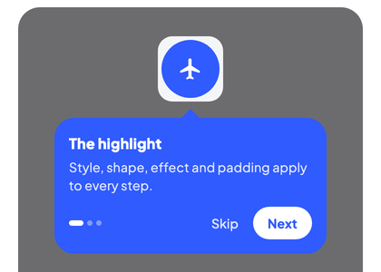
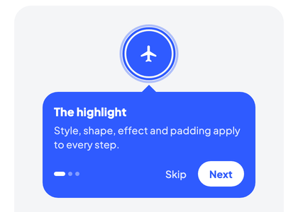

# Highlight Styles

A **highlight style** controls how the area around a tour target is visually emphasized. Waypoint ships with five built-in styles plus a fully custom escape hatch.

| Spotlight | Pulse | Border | Ripple |
|:-:|:-:|:-:|:-:|
|  |  |  |  |

Pulse and Ripple are animated. The sample app's Lab screen switches between all of them on a running tour:

{ width="280" }

## Where it's applied

Highlight styles can be set at two levels:

1. **Host-wide** via `WaypointHost(highlightStyle = ...)` or `WaypointMaterial3Host(highlightStyle = ...)`. Every step inherits this style unless it overrides it.
2. **Per-step** via `highlightStyle = ...` inside a `step { }` block. When a step sets its own style, it takes precedence over the host-level one.

```kotlin
val state = rememberWaypointState {
    step(Targets.SearchBar) {
        title = "Search"
        // Inherits host highlightStyle
    }
    step(Targets.AddButton) {
        title = "Create"
        // Overrides the host default
        highlightStyle = HighlightStyle.Pulse(
            color = Color(0xFF4CAF50),
        )
    }
}

WaypointMaterial3Host(
    state = state,
    highlightStyle = HighlightStyle.Spotlight(
        shape = SpotlightShape.RoundedRect(12.dp),
    ),
) {
    MyScreen()
}
```

!!! note
    A step whose `highlightStyle` is `null` falls back to the host-level style. This is the default behavior when you omit the property. The host-level default is `WaypointDefaults.HighlightStyle`, a `Spotlight()`.

## Variants

### `Spotlight`

Dimmed overlay with a transparent cutout around the target. This is the classic product-tour look and the library default.

```kotlin
highlightStyle = HighlightStyle.Spotlight(
    shape = SpotlightShape.RoundedRect(cornerRadius = 8.dp),
    padding = SpotlightPadding(all = 4.dp),
    overlayColor = Color.Black,
    overlayAlpha = 0.6f,
    effect = SpotlightEffect.None,
    coverWhilePending = false,
)
```

| Parameter | Type | Default | Purpose |
|---|---|---|---|
| `shape` | `SpotlightShape` | `RoundedRect(8.dp)` | Geometry of the cutout. See [shapes](#shapes). |
| `padding` | `SpotlightPadding` | `4.dp` all sides | Extra space between target and cutout edge. |
| `overlayColor` | `Color` | `Color.Black` | Color of the dimmed scrim outside the cutout. |
| `overlayAlpha` | `Float` | `0.6f` | Opacity of the scrim, 0f-1f. |
| `effect` | `SpotlightEffect` | `None` | Optional glow / soft-edge / custom decoration. See [Spotlight Effects](spotlight-effects.md). |
| `coverWhilePending` | `Boolean` | `false` | Keep the screen covered and blocked between steps. See [covering pending steps](#covering-pending-steps). |

Use Spotlight when you want to completely block distractions and focus attention on one element. It's the best fit for product onboarding and guided flows.

#### Touch blocking

Touch blocking is independent of the highlight style. The host's `blockOutside` (default `true`) blocks pointer input outside the highlighted areas while a step is shown, with every style, `None` included. Touches there never reach your app, a tap follows the host's `overlayClickBehavior`. What happens inside the highlighted areas is decided by the step's `interaction`:

| `TargetInteraction` | Inside the highlighted areas |
|---|---|
| `None` (default) | Touches are swallowed. |
| `ClickToAdvance` | A tap advances the tour. The target does not receive it. |
| `PassThrough` | Every gesture reaches the app, in the target and in each of the step's `additionalTargets`. |

The interactive area is the drawn shape's bounding box for the styles that draw a shape around the target (`Spotlight`, `Pulse`, `Border`, padding included) and the target's own bounds for the others.

| Host / step setting | Effect |
|---|---|
| `WaypointHost(blockOutside = true)` (default) | Every step blocks outside the highlighted areas, whatever its style. |
| `WaypointHost(blockOutside = false)` | Nothing is blocked, even with a dimmed `Spotlight`. The tour is purely visual. |
| `step { blockOutside = false }` / `true` | Per-step override of the host value. |

So a blocking tour without dimming can use any undimmed style, for example `HighlightStyle.None` for a tooltip-only tour that still keeps the user on the step, or a transparent spotlight if you want its padding and shape to define the interactive area:

```kotlin
highlightStyle = HighlightStyle.Spotlight(overlayAlpha = 0f)
```

A [step without a target](interactive-tutorials.md#intro-and-outro-cards) blocks the whole host while blocking is on; `Spotlight` also draws the scrim with no cutout, the other styles draw nothing for such a step.

For `SpotlightShape.Circle` the drawn circle reaches beyond a wide or tall target (its radius is half the longer side), and the interactive area follows what is drawn: taps and pass-through use the circle's bounding square.

#### Covering pending steps

Between two steps the scrim can be gone for a moment: the next step's `beforeShow` gate is running, or its target is not laid out yet. By default the app is uncovered and usable meanwhile. With `coverWhilePending = true` the host draws the scrim with no cutout and blocks all input while the current step is pending, so the user cannot wander off between steps:

```kotlin
highlightStyle = HighlightStyle.Spotlight(coverWhilePending = true)
```

The cover blocks input only while `blockOutside` resolves to `true`. The host's `overlayClickBehavior` and the dismiss keys still apply, so `Dismiss` or Escape end the tour from under the cover. A target that scrolls out of view after its step was shown does not count as pending, a `PassThrough` user who scrolls the target away is never trapped. The alternative is to leave the screen uncovered and block your own UI from `WaypointState.isStepVisible`, see [Interactive Tutorials](interactive-tutorials.md#block-your-own-ui-while-a-step-is-pending).

### `Pulse`

An animated pulsing shape around the target. No dimming overlay, the shape breathes (scales + fades) to draw the eye.

```kotlin
highlightStyle = HighlightStyle.Pulse(
    color = Color(0xFF7C4DFF),
    shape = SpotlightShape.Circle,
    padding = SpotlightPadding(all = 8.dp),
    borderWidth = 3.dp,
    filled = false,
    pulseScale = 1.15f,
    durationMillis = 1200,
)
```

| Parameter | Type | Default | Purpose |
|---|---|---|---|
| `color` | `Color` | required | Color of the pulsing shape. |
| `shape` | `SpotlightShape` | `RoundedRect(8.dp)` | Shape drawn around the target. |
| `padding` | `SpotlightPadding` | `4.dp` | Gap between target and shape. |
| `borderWidth` | `Dp` | `3.dp` | Stroke width when `filled = false`. |
| `filled` | `Boolean` | `false` | If true, draws a filled shape instead of a stroke. |
| `pulseScale` | `Float` | `1.15f` | Peak scale of the outer copy. |
| `durationMillis` | `Int` | `1200` | Full pulse cycle duration. |

Use Pulse for subtle hints, feature callouts, or non-blocking tours where dimming the rest of the screen is too heavy-handed. The app stays fully interactive while the step is shown.

### `Border`

A static colored shape around the target. No animation, no overlay.

```kotlin
highlightStyle = HighlightStyle.Border(
    color = Color(0xFFFF9800),
    shape = SpotlightShape.Pill,
    padding = SpotlightPadding(horizontal = 6.dp, vertical = 4.dp),
    borderWidth = 2.dp,
    filled = false,
)
```

| Parameter | Type | Default | Purpose |
|---|---|---|---|
| `color` | `Color` | required | Border / fill color. |
| `shape` | `SpotlightShape` | `RoundedRect(8.dp)` | Shape around the target. |
| `padding` | `SpotlightPadding` | `4.dp` | Gap between target and shape. |
| `borderWidth` | `Dp` | `2.dp` | Stroke width when `filled = false`. |
| `filled` | `Boolean` | `false` | If true, draws a filled shape. |

Use Border for the quietest highlight, or when the surrounding UI is already dark and a full overlay would double up.

### `Ripple`

Expanding concentric rings radiating from the target's center.

```kotlin
highlightStyle = HighlightStyle.Ripple(
    color = Color(0xFF7C4DFF),
    ringCount = 3,
    durationMillis = 2000,
    maxRadius = 60.dp,
    filled = false,
    strokeWidth = 2.dp,
)
```

| Parameter | Type | Default | Purpose |
|---|---|---|---|
| `color` | `Color` | required | Ring color. |
| `ringCount` | `Int` | `3` | Number of concurrent rings. |
| `durationMillis` | `Int` | `2000` | Time for a ring to travel from center to `maxRadius`. |
| `maxRadius` | `Dp` | `60.dp` | Outer extent of each ring. |
| `filled` | `Boolean` | `false` | If true, rings render as filled circles. |
| `strokeWidth` | `Dp` | `2.dp` | Ring stroke width, ignored when `filled` is true. |

Use Ripple to draw attention to small, discrete targets (icons, dots, FABs) where a shape-matched highlight would look cramped.

### `None`

No visual highlight. Only the tooltip is rendered.

```kotlin
highlightStyle = HighlightStyle.None
```

Use `None` for tooltip-only tours, or when you want to handle highlighting yourself (for example, a target that animates its own focus state via `onEnter`).

### `Custom`

Fully custom highlight. The composable receives the raw target bounds, the animated (interpolated) bounds of the primary target, and the bounds of the step's `additionalTargets` that are registered in this host, and can render anything.

```kotlin
highlightStyle = HighlightStyle.Custom { targetBounds, animatedBounds, additionalBounds ->
    // targetBounds: the current target's true rectangle
    // animatedBounds: tween-interpolated rectangle used for smooth transitions
    // additionalBounds: the step's additional targets, not animated
    Canvas(modifier = Modifier.fillMaxSize()) {
        drawRoundRect(
            color = Color.Magenta.copy(alpha = 0.3f),
            topLeft = animatedBounds.topLeft,
            size = animatedBounds.size,
            cornerRadius = CornerRadius(16.dp.toPx()),
        )
    }
}
```

!!! tip
    Prefer `animatedBounds` when drawing so the highlight tweens smoothly between steps. Use `targetBounds` only when you need the exact, non-animated destination.

## Shapes

Every spotlight/pulse/border style accepts a `SpotlightShape`:

| Shape | Notes |
|---|---|
| `SpotlightShape.Circle` | Circle enclosing the target. Radius is half of the longer target dimension, so square targets fit snugly and wide targets get a large circle. |
| `SpotlightShape.Rect` | Rectangle matching the target bounds exactly. |
| `SpotlightShape.RoundedRect(cornerRadius: Dp)` | Rounded rectangle. Defaults to `8.dp` corner radius. This is also `SpotlightShape.Default`. |
| `SpotlightShape.Pill` | Rounded rectangle with corner radius equal to half the height. Ideal for chip- or pill-shaped controls. |

```kotlin
// Circular icon target
highlightStyle = HighlightStyle.Spotlight(shape = SpotlightShape.Circle)

// Wide button that should stay rectangular
highlightStyle = HighlightStyle.Spotlight(shape = SpotlightShape.RoundedRect(12.dp))

// Chip-shaped filter
highlightStyle = HighlightStyle.Spotlight(shape = SpotlightShape.Pill)
```

## Padding

`SpotlightPadding` adds space between the target and the highlight edge. This is especially useful for tightly-cropped icons.

```kotlin
// Uniform
padding = SpotlightPadding(all = 8.dp)

// Horizontal vs vertical
padding = SpotlightPadding(horizontal = 12.dp, vertical = 6.dp)

// Per side
padding = SpotlightPadding(start = 4.dp, top = 8.dp, end = 4.dp, bottom = 8.dp)
```

`SpotlightPadding.Default` is `4.dp` on all sides. `SpotlightPadding.None` is zero on all sides.

## See also

- [Interactive Tutorials](interactive-tutorials.md), `PassThrough` steps and the transparent scrim
- [Spotlight Effects](spotlight-effects.md), decorate the Spotlight cutout with glows, soft edges, or custom draw code
- [Custom Tooltips](custom-tooltips.md), replace the tooltip body while keeping any highlight style
- [WaypointState API](../api/waypoint-state.md), full reference for `rememberWaypointState` and step configuration
